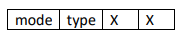

# 17-bit-processor-with-my-own-ISA

## ISA Configuration
For this ISA, the machine code will be composed of words of 17 bits of length. What 
led to the decision of this word length is the purpose of using the memory efficiently in a 
more compact way while also keeping the controller as simple as possible. Memory 
instructions require the most bits so they decide on the minimum.

Machine code for data processing instructions:

“op” determines whether the instruction is a data processing, memory or branch 
instruction. For data processing instructions op takes the value 00. “Funct” contains the 
details for each op type. Rd , Rn and Rm are destination rtegister, first operand and second 
operand respectively. I bit determines if the addition and subtraction operations are indirect. 
I bit is invalid for other operations.

Funct section for data processing instructions:

Following table shows how the Funct section controls the operations:

Machine code for memory instructions: 

Funct section for memory is as follows:

Mode bit fetermines if the instruction is a load or store operation. Type bit is only valid for 
LDR operations and specifies if the operation is an immediate adressed load or direct 
address load. The rest is don’t cares. Following table shows how it behaves:

Machine code for branch instructions:

From 10 to 8th bits of the machine code is the pointer to the 6th register in the register file 
which is the link register. That section is only valid for branches with link. 

Funct section for the branch contains the condition information:

How the cond section determines the branch condition is given in the following table:

